#### 
Вайцеховський Олександр 3.02

### 
Практичне заняття №1

#### Тема: Проходження інтерактивного курсу «Git How To»
#### Мета: Ознайомитися з базовими командами та принципами роботи з системою контролю версій Git шляхом проходження інтерактивного навчального курсу. Сформувати практичні навички використання Git у консольному середовищі для виконання основних операцій.

#### Хід роботи:

1. Спочатку було встановлено юзера гіту, створення гілки та налаштування коректної обробки закінчень рядків:
Команда:

Результат:
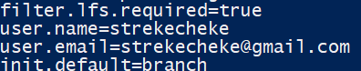
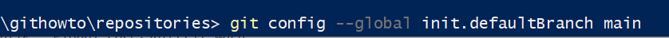

2. Наступним кроком було створення директорії та простого текстового файлу:
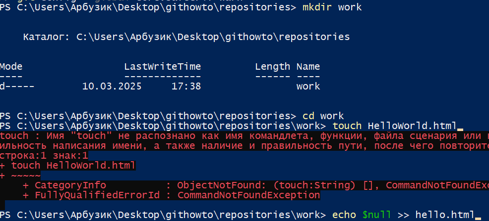
Після було створено локальний репозиторій та першого коміту:
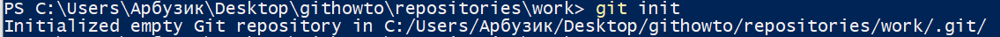

3. Перевірка статусу репозиторію:
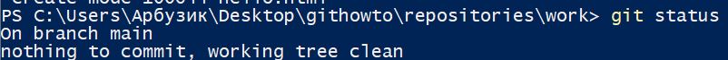
4. Внесення змін до файлу HelloWorld:
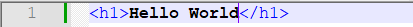
5. Перевірка статусу і індексація зміни:
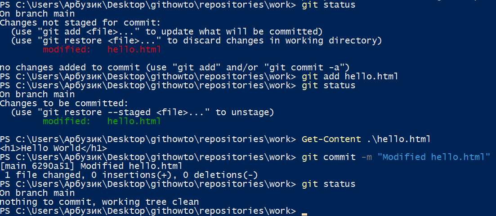
6. Додавання контенту до файлу і ще одна індексація за допомогою текстового редактору:
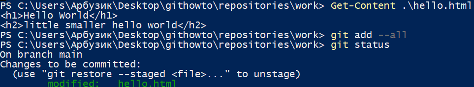
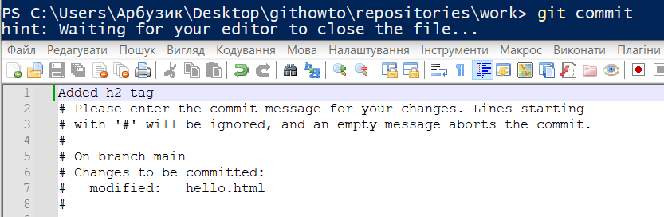
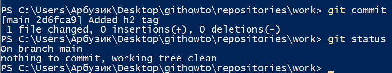
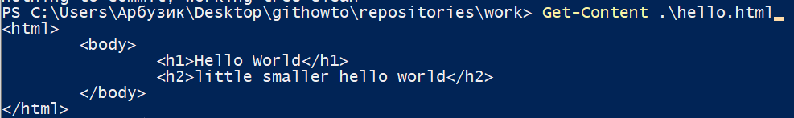
7. Ще декілька для індексацій задля лабороторних цілей:
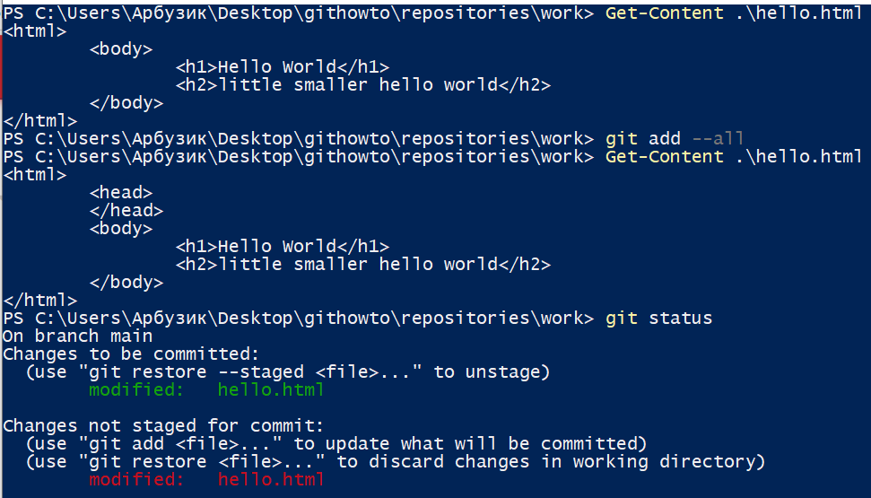
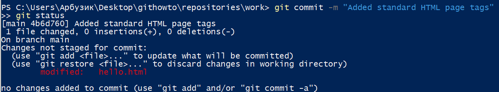
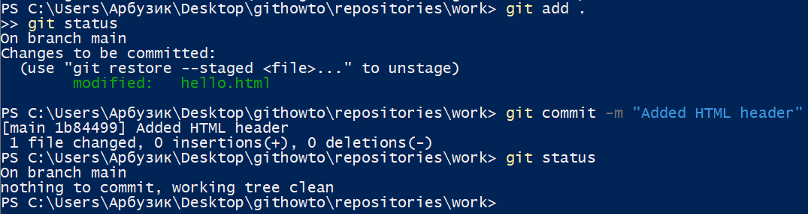
8. Перегляд індеків комітів або змін у репозиторію:
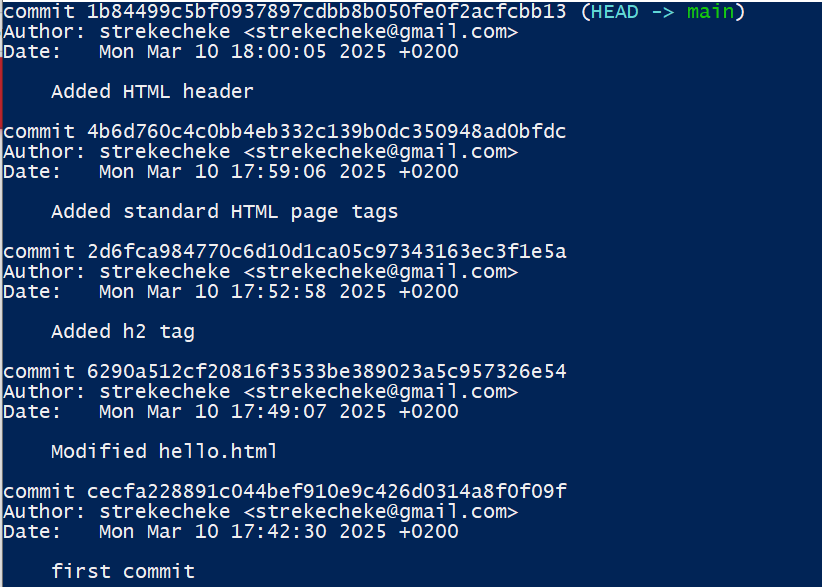
Другий режим відображення:

Відображення змін не старіших за 7 днів:
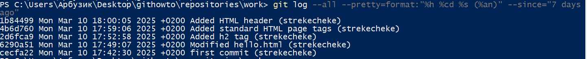
Відображення змін з короткими датами:
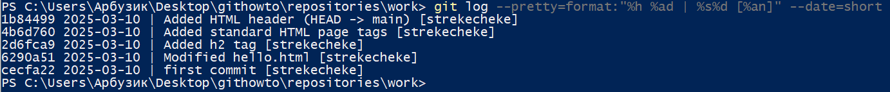
Зміна формату відображення логів глобалдьно для середовища:
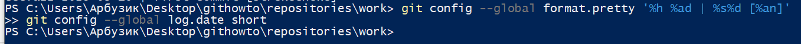
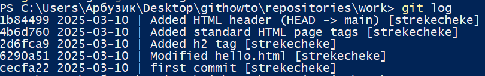
9. Переключення до попередніх змін:
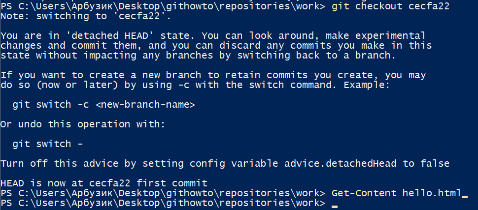
