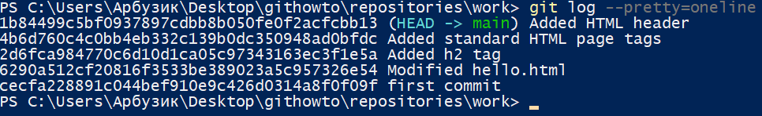
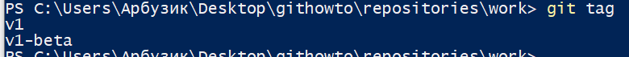
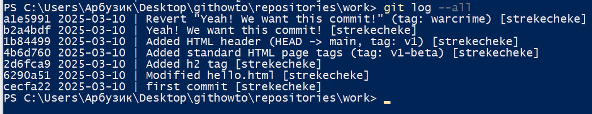
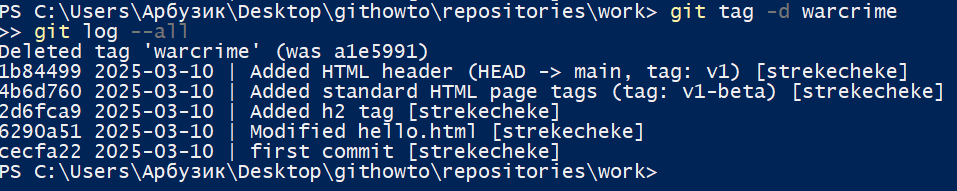
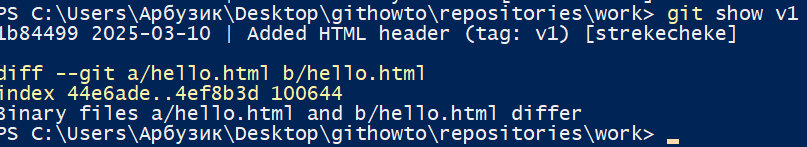
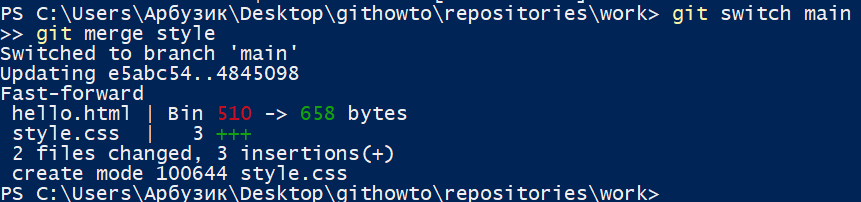

#### 
Вайцеховський Олександр 3.02

### 
Практичне заняття №1

#### Тема: Проходження інтерактивного курсу «Git How To»
#### Мета: Ознайомитися з базовими командами та принципами роботи з системою контролю версій Git шляхом проходження інтерактивного навчального курсу. Сформувати практичні навички використання Git у консольному середовищі для виконання основних операцій.

#### Хід роботи:

1. Спочатку було встановлено юзера гіту, створення гілки та налаштування коректної обробки закінчень рядків:
Команда:

Результат:

2. Наступним кроком було створення директорії та простого текстового файлу:

Після було створено локальний репозиторій та першого коміту:

3. Перевірка статусу репозиторію:

4. Внесення змін до файлу HelloWorld:

5. Перевірка статусу і індексація зміни:

6. Додавання контенту до файлу і ще одна індексація за допомогою текстового редактору:

7. Ще декілька для індексацій задля лабороторних цілей:

8. Перегляд індеків комітів або змін у репозиторію:

Другий режим відображення:

Відображення змін не старіших за 7 днів:

Відображення змін з короткими датами:

Зміна формату відображення логів глобалдьно для середовища:

9. Переключення до попередніх змін:

10. Додавання тегів\марок до змін:

Перевірка існування тегу:

Додавання ще одного:

Перевірка:

Список усіх наявних тегів у репозиторії:

11. Відкат змін:
Зміна файлу:

Відкат зміни:

Нова зміна файлу:

Відміна додавання зміни до коміту:

Відміна зміни файлу:

12. Відкат коміту:
Створення коміту:

Відкат коміту:

Помітка відміненого коміту:

14. Відкат репозиторію до минулого коміту:

Видалення коміту із тегом:

16. Модифікація коміту:

18. Створення нової гілки:

Переключення до основної гілки:

19. Переіменування файлу:

20. Додавання до основної гілки README:

Історія комітів у гілковій системі:

21. Мердж\Об'єднання гілок

22. Вирішення конфлікту файлів:
Переключення на гілку стилів:

Відміна об'єднання гілок для нових комітів style:

23. Ще трохи вирішення конфліктів:

Зміна директорії:

24. Додавання відаленої точки роздачі репозиторію:

### Висновки:
Під час виконання цієї практичної роботи, було засвоєно знання про системи контролю версій на прикладі Git, синтаксису та приміненю команд Git репозиторію та встановлення віддаленого репозиторію на хостингу GitHub
